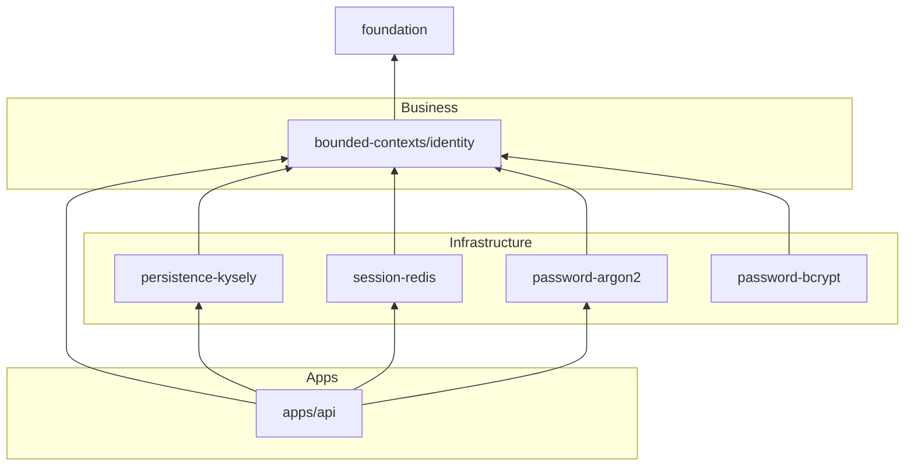

```mermaid
flowchart BT

    subgraph Apps
        API["apps/api"]
    end

    subgraph Infrastructure
        Kysely["persistence-kysely"]
        Redis["session-redis"]
        Argon2["password-argon2"]
        Bcrypt["password-bcrypt"]
    end

    subgraph Business
        Identity["bounded-contexts/identity"]
    end

    Foundation["foundation"]

    API --> Identity

    API --> Kysely
    API --> Redis
    API --> Argon2

    Kysely --> Identity
    Redis --> Identity
    Argon2 --> Identity
    Bcrypt --> Identity

    Identity --> Foundation
```
