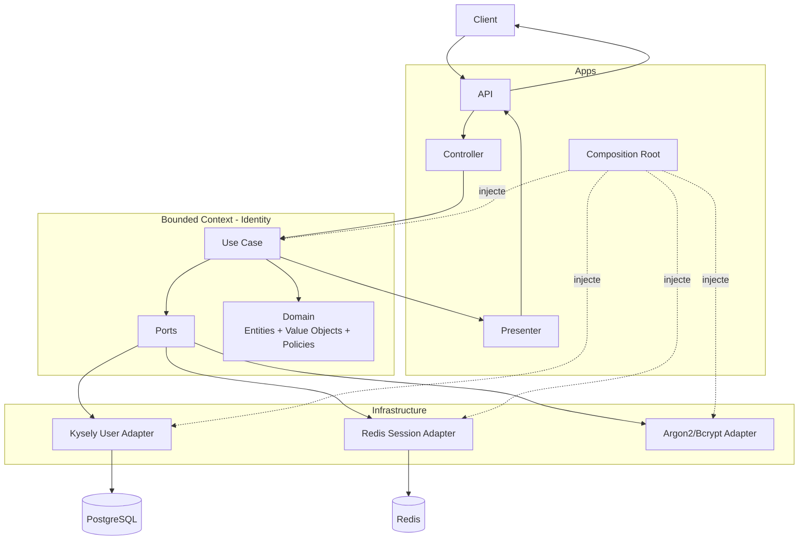

```mermaid
flowchart TD
    Client[Client]

    subgraph Apps
        API[API]
        Controller[Controller]
        Presenter[Presenter]
        CompositionRoot[Composition Root]
    end

    subgraph "Bounded Context - Identity"
        UC[Use Case]
        Ports[Ports]
        Domain[Domain<br/>Entities + Value Objects + Policies]
    end

    subgraph Infrastructure
        UserAdapter[Kysely User Adapter]
        SessionAdapter[Redis Session Adapter]
        PasswordAdapter[Argon2/Bcrypt Adapter]
    end

    Database[(PostgreSQL)]
    Redis[(Redis)]

    Client --> API
    API --> Controller
    Controller --> UC

    UC --> Domain
    UC --> Ports

    Ports --> UserAdapter
    Ports --> SessionAdapter
    Ports --> PasswordAdapter

    UserAdapter --> Database
    SessionAdapter --> Redis

    UC --> Presenter
    Presenter --> API
    API --> Client

    CompositionRoot -. injecte .-> UC
    CompositionRoot -. injecte .-> UserAdapter
    CompositionRoot -. injecte .-> SessionAdapter
    CompositionRoot -. injecte .-> PasswordAdapter
```
