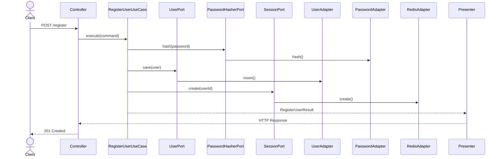

```mermaid
sequenceDiagram

    actor Client

    participant Controller
    participant RegisterUserUseCase
    participant UserPort
    participant PasswordHasherPort
    participant SessionPort
    participant UserAdapter
    participant PasswordAdapter
    participant RedisAdapter
    participant Presenter

    Client->>Controller: POST /register

    Controller->>RegisterUserUseCase: execute(command)

    RegisterUserUseCase->>PasswordHasherPort: hash(password)
    PasswordHasherPort->>PasswordAdapter: hash()

    RegisterUserUseCase->>UserPort: save(user)
    UserPort->>UserAdapter: insert()

    RegisterUserUseCase->>SessionPort: create(userId)
    SessionPort->>RedisAdapter: create()

    RegisterUserUseCase-->>Presenter: RegisterUserResult
    Presenter-->>Controller: HTTP Response

    Controller-->>Client: 201 Created
```
